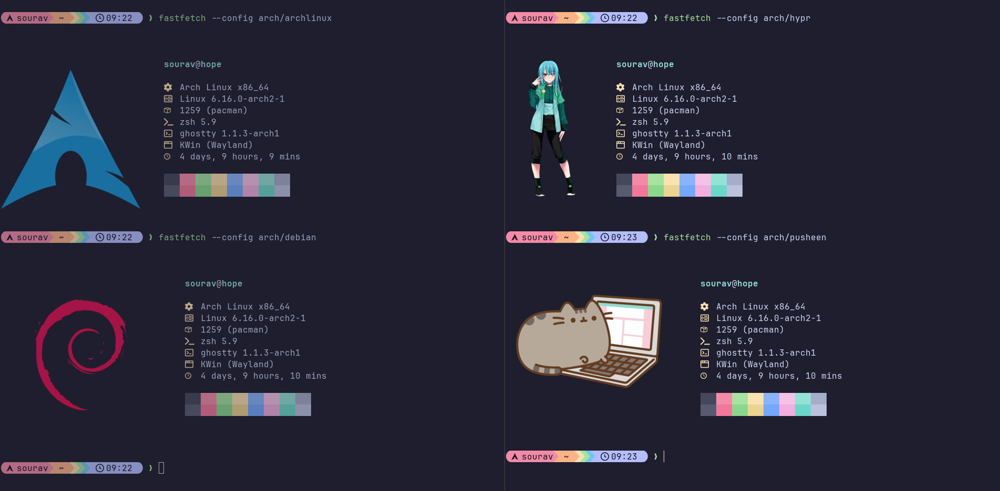
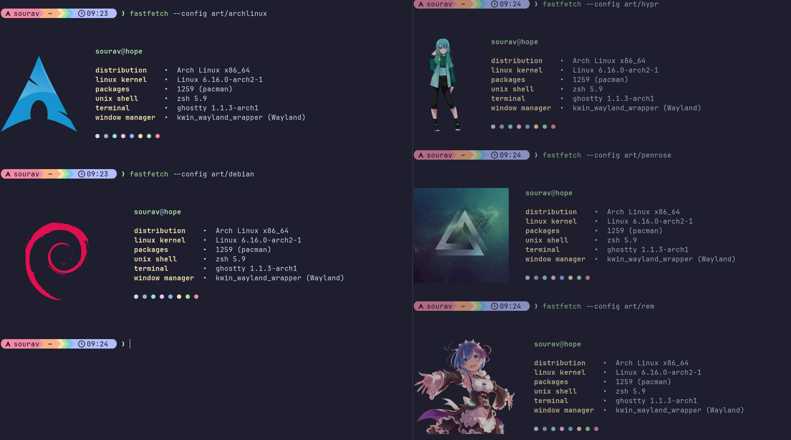
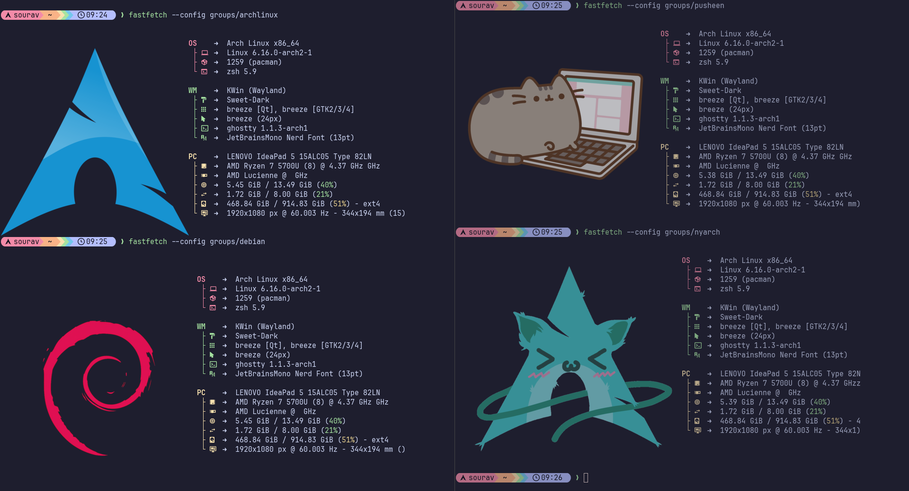
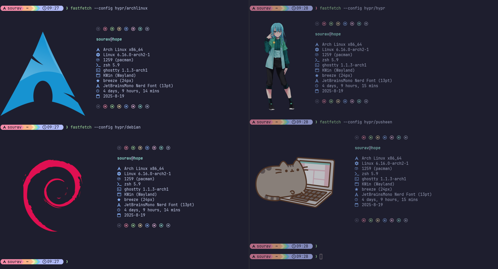
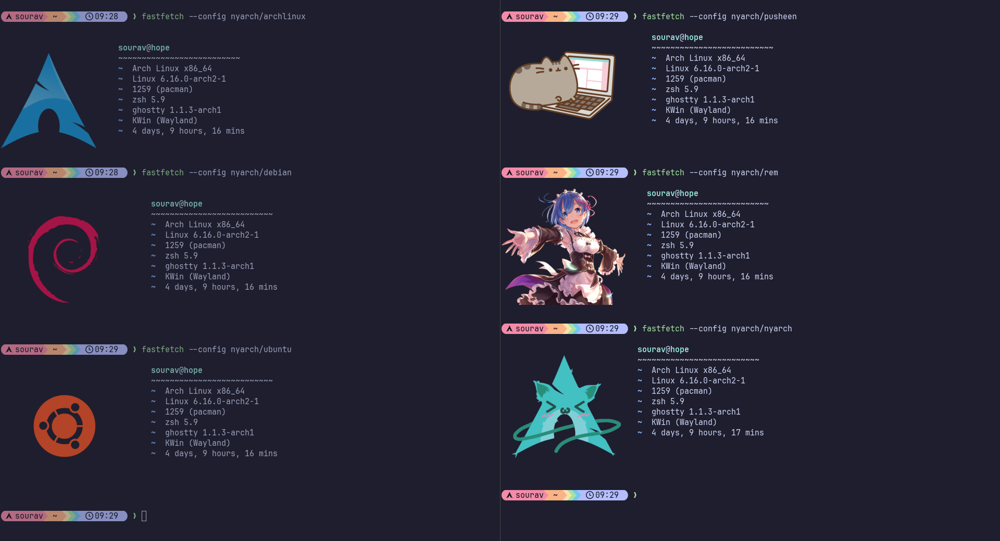
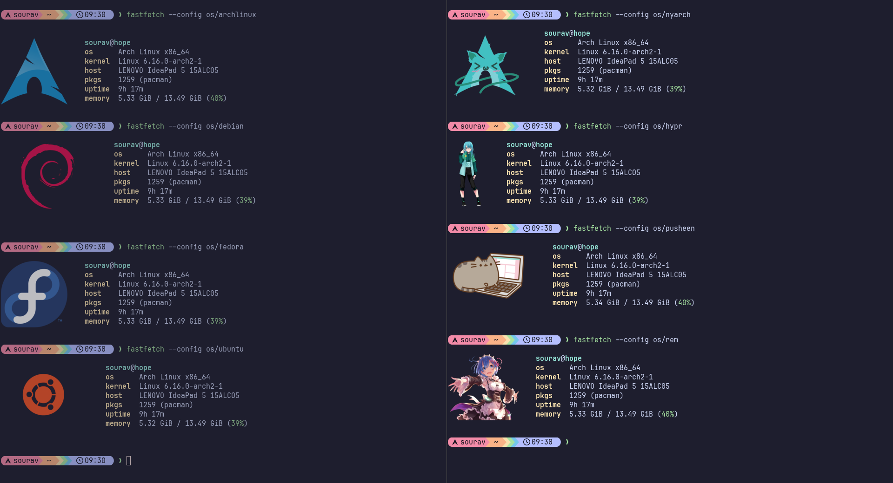

# Fastfetch Configuration Collection

<div align="center">

🚀 **A curated collection of beautiful fastfetch configurations** 🚀

[](https://github.com/souravas/fastfetch/stargazers)
[](https://github.com/souravas/fastfetch/network)

*A comprehensive collection of fastfetch presets*

</div>

## About

[Fastfetch](https://github.com/fastfetch-cli/fastfetch) is a modern system information tool that displays your system stats in a beautiful, customizable way. This repository contains:

- **54 unique preset configurations** across 6 different themes
- **9 matching image sets** for visual consistency
- **Easy customization** through editable configuration arrays

> **Note**: This repository is forked from [LierB/fastfetch](https://github.com/LierB/fastfetch) with improved organization.</div>

## Screenshots

<div align="center">

### Different Preset Styles

<table>
<tr>
<td align="center">

<br><em>Arch Theme</em>
</td>
<td align="center">

<br><em>Art Style</em>
</td>
<td align="center">

<br><em>Groups Layout</em>
</td>
</tr>
<tr>
<td align="center">

<br><em>Hypr Theme</em>
</td>
<td align="center">

<br><em>Nyarch Theme</em>
</td>
<td align="center">

<br><em>OS Theme</em>
</td>
</tr>
</table>

*Experience different visual styles by manually selecting any combination*

</div>

## Installation

Clone the repository into your local share directory:

```sh
cd ~/.local/share
git clone https://github.com/souravas/fastfetch
```

> **Note**: This repository is forked from [LierB/fastfetch](https://github.com/LierB/fastfetch) with additional enhancements.

## Usage

### Manual Configuration Selection

Run fastfetch with a specific preset using the folder/config pattern:

```sh
fastfetch --config arch/archlinux
fastfetch --config hypr/fedora
fastfetch --config groups/pusheen
```

### 🎯 All Available Combinations

You can use any combination of folders and themes. Here are all 54 available configurations:

#### Arch Folder (9 configurations)

**Linux Distributions (4):**
```sh
fastfetch --config arch/archlinux
fastfetch --config arch/debian
fastfetch --config arch/fedora
fastfetch --config arch/ubuntu
```

**Other Themes (5):**
```sh
fastfetch --config arch/hypr
fastfetch --config arch/nyarch
fastfetch --config arch/penrose
fastfetch --config arch/pusheen
fastfetch --config arch/rem
```

#### Art Folder (9 configurations)

**Linux Distributions (4):**
```sh
fastfetch --config art/archlinux
fastfetch --config art/debian
fastfetch --config art/fedora
fastfetch --config art/ubuntu
```

**Other Themes (5):**
```sh
fastfetch --config art/hypr
fastfetch --config art/nyarch
fastfetch --config art/penrose
fastfetch --config art/pusheen
fastfetch --config art/rem
```

#### Groups Folder (9 configurations)

**Linux Distributions (4):**
```sh
fastfetch --config groups/archlinux
fastfetch --config groups/debian
fastfetch --config groups/fedora
fastfetch --config groups/ubuntu
```

**Other Themes (5):**
```sh
fastfetch --config groups/hypr
fastfetch --config groups/nyarch
fastfetch --config groups/penrose
fastfetch --config groups/pusheen
fastfetch --config groups/rem
```

#### Hypr Folder (9 configurations)

**Linux Distributions (4):**
```sh
fastfetch --config hypr/archlinux
fastfetch --config hypr/debian
fastfetch --config hypr/fedora
fastfetch --config hypr/ubuntu
```

**Other Themes (5):**
```sh
fastfetch --config hypr/hypr
fastfetch --config hypr/nyarch
fastfetch --config hypr/penrose
fastfetch --config hypr/pusheen
fastfetch --config hypr/rem
```

#### Nyarch Folder (9 configurations)

**Linux Distributions (4):**
```sh
fastfetch --config nyarch/archlinux
fastfetch --config nyarch/debian
fastfetch --config nyarch/fedora
fastfetch --config nyarch/ubuntu
```

**Other Themes (5):**
```sh
fastfetch --config nyarch/hypr
fastfetch --config nyarch/nyarch
fastfetch --config nyarch/penrose
fastfetch --config nyarch/pusheen
fastfetch --config nyarch/rem
```

#### OS Folder (9 configurations)

**Linux Distributions (4):**
```sh
fastfetch --config os/archlinux
fastfetch --config os/debian
fastfetch --config os/fedora
fastfetch --config os/ubuntu
```

**Other Themes (5):**
```sh
fastfetch --config os/hypr
fastfetch --config os/nyarch
fastfetch --config os/penrose
fastfetch --config os/pusheen
fastfetch --config os/rem
```

### 🚀 Quick Access with Aliases

Add these convenient aliases to your `~/.bashrc` or `~/.zshrc` for quick access:

```bash
# Fastfetch aliases - add to ~/.bashrc or ~/.zshrc
alias ff='fastfetch --config'
alias ffa='fastfetch --config arch/archlinux'
alias ffh='fastfetch --config hypr/hypr'
alias ffp='fastfetch --config groups/pusheen'

# Or create a function for easier browsing
ff() {
    if [ $# -eq 0 ]; then
        echo "Usage: ff <folder>/<theme>"
        echo "Folders: arch, art, groups, hypr, nyarch, os"
        echo "Themes: archlinux, debian, fedora, hypr, nyarch, penrose, pusheen, rem, ubuntu"
        echo "Example: ff arch/archlinux"
    else
        fastfetch --config "$1"
    fi
}
```

After adding to your shell config, reload it:
```bash
source ~/.bashrc  # or ~/.zshrc
```

Then you can use:
```bash
ff arch/archlinux    # Quick fastfetch run
ffa                  # Arch Linux theme
ffh                  # Hyprland theme
ffp                  # Pusheen theme
ff                   # Show help
```

## 📁 Available Presets

<div align="center">

| **Preset Folders** | **Description** |
|:---:|:---|
| 🏛️ **arch** | Arch Linux themed configurations |
| 🎨 **art** | ASCII art focused presets |
| 📊 **groups** | Grouped information display |
| 🪟 **hypr** | Hyprland window manager themed |
| 🐱 **nyarch** | Nyarch (cat-themed Arch) configurations |
| 💻 **os** | Operating system focused presets |

</div>

### 🎭 Configuration Themes

<details>
<summary><strong>Click to view all 9 available themes</strong></summary>

| Theme | Description | Image |
|:---:|:---|:---:|
| **archlinux** | Classic Arch Linux styling | `archlinux.png` |
| **debian** | Debian Linux theming | `debian.png` |
| **fedora** | Fedora Linux styling | `fedora.png` |
| **hypr** | Hyprland specific theming | `hypr.png` |
| **nyarch** | Cute cat-themed styling | `nyarch.png` |
| **penrose** | Penrose tiling patterns | `penrose.png` |
| **pusheen** | Pusheen cat character theme | `pusheen.png` |
| **rem** | Anime character theme | `rem.png` |
| **ubuntu** | Ubuntu Linux styling | `ubuntu.png` |

</details>

**Total Combinations**: 6 folders × 9 themes = **54 unique configurations**

## 🛠️ Customization

You can easily add your own configurations by:

1. **Adding new themes**: Create new `.jsonc` files in existing folders
2. **Creating new folders**: Add new folders under `presets/` with your own theme files
3. **Modifying existing configs**: Edit any `.jsonc` file to customize the output

### Examples

```sh
# Arch-themed with Arch logo
fastfetch --config arch/archlinux

# Hyprland theme with Pusheen image
fastfetch --config hypr/pusheen

# Groups display with Fedora styling
fastfetch --config groups/fedora

# Art style with Ubuntu theming
fastfetch --config art/ubuntu
```

## 🤝 Contributing

Feel free to:
- Add new preset configurations
- Create new theme images
- Submit bug reports or feature requests

